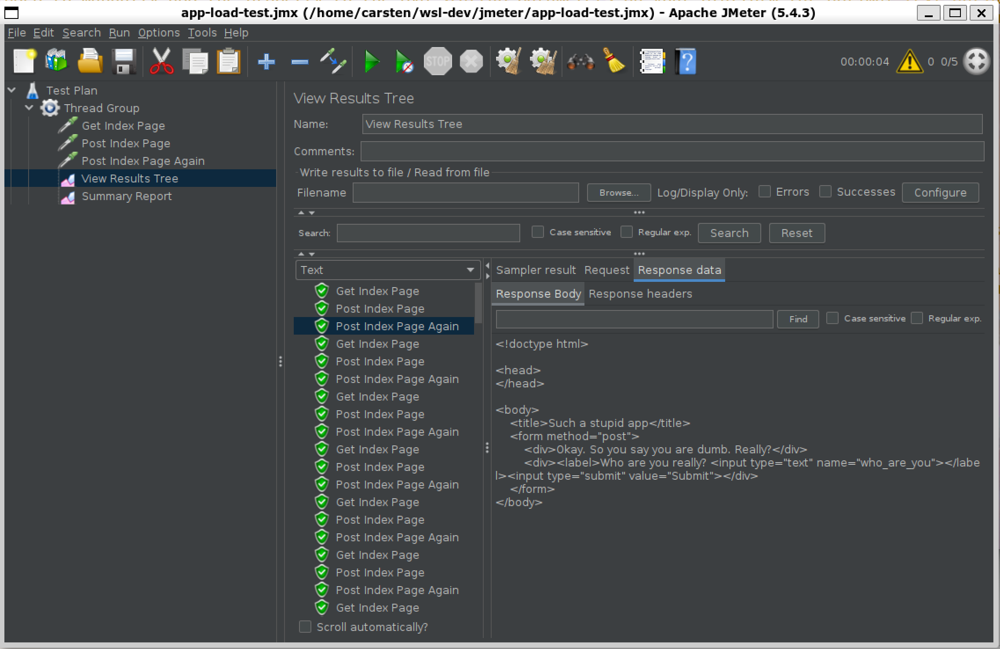

# wsl-dev

A sample repository to demonstrate using [WSL2](https://docs.microsoft.com/en-us/windows/wsl/) for development:

* Edit in Windows but build/run/debug in Linux using [VS Code and the WSL Remote Extension](https://docs.microsoft.com/en-us/windows/wsl/tutorials/wsl-vscode).
* Running JMeter as a load test editor, running in Linux, but the UI rendered in Windows, using the [WSL GUI feature](https://docs.microsoft.com/en-us/windows/wsl/tutorials/gui-apps).

**Why?** Because we can keep our Windows OS free from arbitrary versions of Java, Python and the like. And we can test different variants in much more isolation. For example, if you do not have a specific Python/Java/.NET/Whatever version installed on your machine, but you want to try something with it, you can safely use a WSL distro for this. Or, if you do not want to have a JDK on your machine at all, but you need to create a load test in JMeter (which is the required format for the new [Azure Load Testing Service](https://docs.microsoft.com/en-us/azure/load-testing/overview-what-is-azure-load-testing) **and** requires a JDK), you can easily do that in WSL - even though JMeter requires a GUI.

## Prerequisites

Windows 11 Build 22000 or later.

## Getting started

1. [Install WSL](https://docs.microsoft.com/en-us/windows/wsl/install) and a distribution of your choice (we assume Ubuntu 20, others might need changes).

1. On Windows, [install VS Code and the Remote WSL extension](https://docs.microsoft.com/en-us/windows/wsl/tutorials/wsl-vscode#install-vs-code-and-the-remote-wsl-extension).

1. Open a shell in your WSL distro.

1. In the WSL shell: If git is not installed (it should typically), [install git](https://git-scm.com/download/linux).

1. Clone this repo and navigate into the cloned local repo:

   ```sh
   git clone https://github.com/cadullms/wsl-dev
   cd wsl-dev
   ```
1. In the WSL shell, execute the scripts in the ``init`` folder (``install-pwsh.sh`` is optional).

   ```sh
   cd init
   chmod +x install-jmeter.sh
   ./install-jmeter.sh
   chmod +x configure-python.sh
   ./configure-python.sh
   cd ..
   ```

### VS Code with WSL Remote extension

1. Navigate to the ``app`` folder, which contains a very simple Python flask web app, and start Visual Studio Code:

   ```sh
   cd app
   code .
   ```

   This should do several things:
     * Open VS Code in Windows (not in WSL) - check the PATH variable in your session to glimpse a bit of the magic that makes this happen.
     * Open the Remote extension in VS Code.
     * Install the VS Code Server in your distro. * Open the ``app`` folder from the WSL file system and display its contents in VS Code's explorer.

1. Explore the code and make some changes (optionally).

1. Start a [terminal in VS Code](https://code.visualstudio.com/docs/editor/integrated-terminal). This should conveniently open a bash shell directly in the ``app`` folder in WSL.

1. In the new terminal in VS Code, start the application:
   ```sh
   python hello-world.py
   ```
   The app will listen on port 5000 on your host.

1. On your original shell **in WSL**, type:

   ```sh
   explorer.exe http://127.0.0.1:5000
   ```

   This will open the default web browser **on Windows** and navigate to ``http://127.0.0.1:5000``, so that you can "test" the application.

   This is another example of how WSL can start Windows processes.

### JMeter in WSL

1. Make sure the sample application is running. If not, open a shell and start the application:

   ```sh
   cd app
   python hello-world.py
   ```

1. In a separate shell in your distro, navigate to the ``jmeter`` folder and start JMeter:

   ```sh
   cd jmeter
   jmeter -t app-load-test.jmx
   ```

   This will open JMeter running in WSL, but the JMeter UI will render on the Windows desktop.

1. In the JMeter GUI, explore the test, run it, and explore the results (in the explorer of the JMeter GUI, navigate Test Plan/Thread Group/View Results Tree).

   

   This is of course a very simple test and it relies on the application being available on the local machine. In the real world we would advance this by at least...
      
      * Making sure we have an instance of our app deployed to a production-like environment.
      * Parameterizing the test so that it can work with different URLs.
      * Running the load test in an actual load test service like [Azure Load Testing Service](https://docs.microsoft.com/en-us/azure/load-testing/overview-what-is-azure-load-testing).
      * Automating the process including pipelines creating the infrastructure, deploying the latest version of the application and running the load test (among other test types)...

## More to explore...
* Running this in containers. Can a ``.devcontainer`` run GUI apps as well?
* Exploring the git integration.
* Installing VS Code extensions exclusively for this distro.
